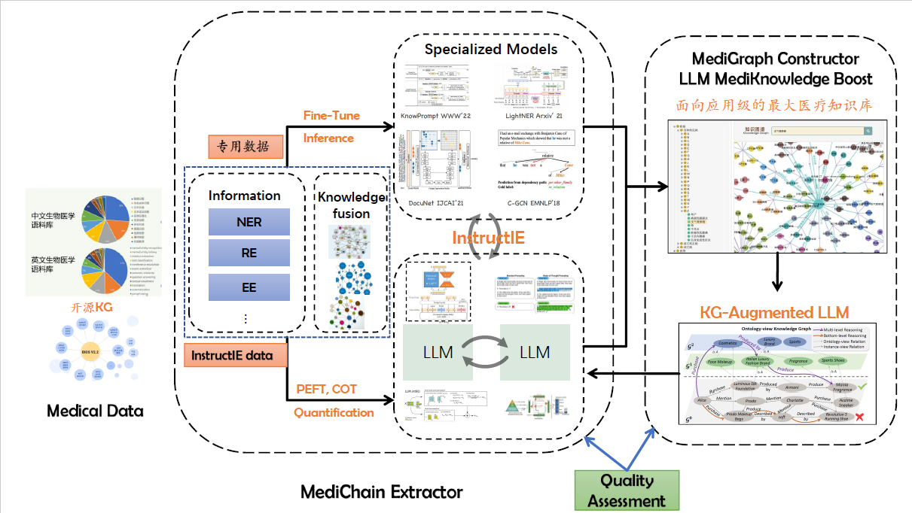

<p align="center">
    </a>
<p>
<!-- 这里可以添加更多的标识 -->
<p align="center">  
<a href="https://pypi.org/project/intellimed/#files">
    
</a>
<p>

<h1 align="center">
    <p>IntelliMed Nexus Toolchain</p>
</h1>

IntelliMed Nexus 工具链主要是用于医学信息抽取，包括医学实体识别、医学关系抽取、医学事件抽取等。用户可以即插即用，无需关注代码细节。

## 快速上手
#### 手动环境部署
**Step 1**：下载代码 ```(https://github.com/WY-Lan/IntelliMed.git)```（别忘记star和fork哈！！！）

**Step 2**：使用anaconda创建虚拟环境，进入虚拟环境

```bash
conda create -n intellimed python=3.8

conda activate intellimed
```
1） 基于pip安装，直接使用

```bash
pip install intellimed
```

2） 基于源码安装

```bash
pip install -r requirements.txt

python setup.py install

python setup.py develop
```
